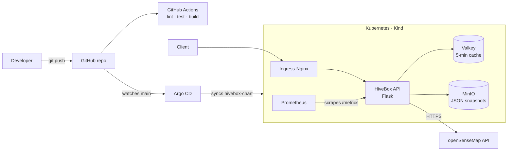

# 🐝 HiveBox

An end-to-end DevOps project: a REST API that fetches sensor data (temperature etc.) from [openSenseMap](https://opensensemap.org) and makes it useful for beekeepers, built all the way from code to production-like operation on Kubernetes.

The project follows [DevOps Hive's Dynamic DevOps Roadmap](https://devopsroadmap.io/projects/hivebox/) and was done in seven gradual phases: from basic Python code to a fully GitOps-driven Kubernetes deployment.

## Architecture



## Status

- [x] Phase 1: Kickoff & preparation
- [x] Phase 2: Base code & Docker
- [x] Phase 3: API endpoints & CI
- [x] Phase 4: Kubernetes & metrics
- [x] Phase 5: Cache, storage & Helm
- [x] Phase 6: GitOps with Argo CD
- [x] Phase 7: Capstone → see the related project [greenops-cost-estimator](https://github.com/arash00009/greenops-cost-estimator)

## Tech stack

Python (Flask), Docker, Kubernetes, Helm, Argo CD, Valkey, MinIO, Prometheus, GitHub Actions

## Running the application

### Locally

```bash
python3 app.py
```

### With Docker

```bash
docker build -t hivebox:v0.3.0 .
docker run --rm -p 5000:5000 hivebox:v0.3.0
```

Both should print the current version, e.g. `v0.3.0`.

## API endpoints

### GET /version

Returns the current version of the application.

```bash
curl http://localhost:5000/version
```
```json
{"version": "v0.3.0"}
```

### GET /temperature

Returns the average temperature from 3 senseBoxes (openSenseMap), read from the cache if available, otherwise fetched live. Only uses measurements that are at most 1 hour old.

```bash
curl http://localhost:5000/temperature
```
```json
{"temperature": 15.12, "unit": "celsius", "status": "Good", "sensors_used": 3}
```

If no fresh data is available, the endpoint returns status 503 with an error message.

### GET /cache

Forces an immediate cache refresh (outside the regular 5-minute cycle).

```bash
curl http://localhost:5000/cache
```
```json
{"message": "Cache updated", "data": {"temperature": 15.12, "unit": "celsius", "status": "Good", "sensors_used": 3}}
```

### GET /store

Stores a timestamped copy of the latest temperature data in MinIO.

```bash
curl http://localhost:5000/store
```
```json
{"message": "Data stored", "object": "temperature-20260905T192936.json"}
```

### GET /readyz

Readiness check. Returns 503 if more than half of the senseBoxes are unreachable.

```bash
curl http://localhost:5000/readyz
```
```json
{"status": "ready"}
```

### GET /metrics

Exposes Prometheus metrics: standard HTTP request counters, response times and Python process info.

## Tests

```bash
pip install -r requirements.txt
pytest -v
```

## Linting

```bash
flake8 app.py test_app.py --max-line-length=100
```

## Running on Kubernetes (locally with Kind)

```bash
# Create the cluster
kind create cluster --name hivebox --config k8s/kind-config.yaml

# Install Ingress-Nginx
kubectl apply -f https://raw.githubusercontent.com/kubernetes/ingress-nginx/main/deploy/static/provider/kind/deploy.yaml

# Build and load the image
docker build -t hivebox:v0.3.0 .
kind load docker-image hivebox:v0.3.0 --name hivebox

# Deploy with Helm
helm install hivebox hivebox-chart/
```

The app is then available at `http://localhost:8080` (port 80 is mapped to 8080 in the Kind config to avoid local port conflicts).

Configurable values (image tag, replica count, environment variables for Valkey/MinIO etc.) are in `hivebox-chart/values.yaml`.

Uninstall:
```bash
helm uninstall hivebox
```

## Cache and storage

The app uses **Valkey** (Redis-compatible) to cache temperature data for 5 minutes, and **MinIO** (S3-compatible) to periodically store data as JSON objects.

## GitOps with Argo CD

The application is deployed declaratively with Argo CD, which automatically syncs the cluster to the Helm chart in this repo (`hivebox-chart/`) every time `main` is updated. No manual `kubectl apply` or `helm upgrade` is needed after the first install.

### Install Argo CD

```bash
kubectl create namespace argocd
kubectl apply -n argocd --server-side -f https://raw.githubusercontent.com/argoproj/argo-cd/stable/manifests/install.yaml
```

### Create the Application

```bash
kubectl apply -f k8s/argocd/hivebox-application.yaml
```

Auto-sync and self-heal are enabled.

### Open the Argo CD UI

```bash
kubectl port-forward svc/argocd-server -n argocd 8081:443
```

Open `https://localhost:8081` and log in as `admin` with the password from:
```bash
kubectl -n argocd get secret argocd-initial-admin-secret -o jsonpath="{.data.password}" | base64 -d
```

## Related project

[**greenops-cost-estimator**](https://github.com/arash00009/greenops-cost-estimator): the capstone project (Phase 7), a standalone API that estimates cloud cost and CO2 footprint for different cloud regions, built with the same method.

## About

Built by [Arash Rahimi](https://github.com/arash00009) as a portfolio project to show end-to-end DevOps and platform engineering: from application code to containers, CI/CD, Kubernetes, observability and GitOps.
